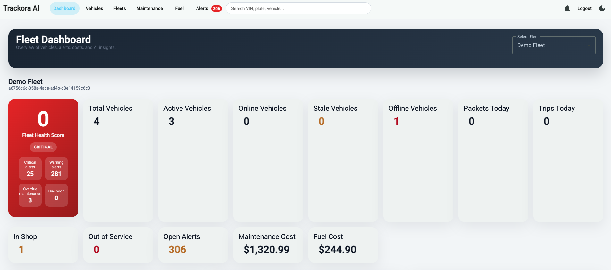
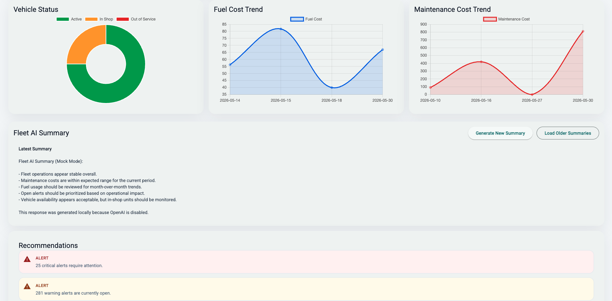
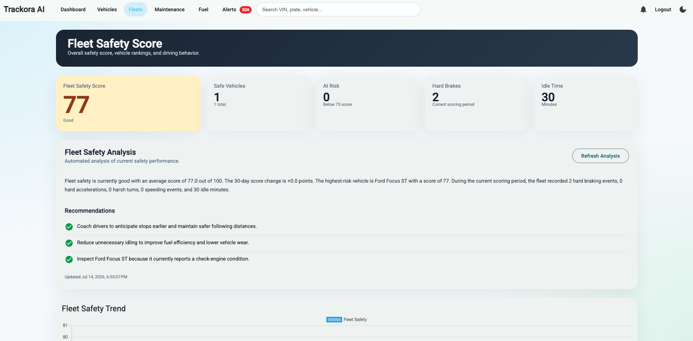
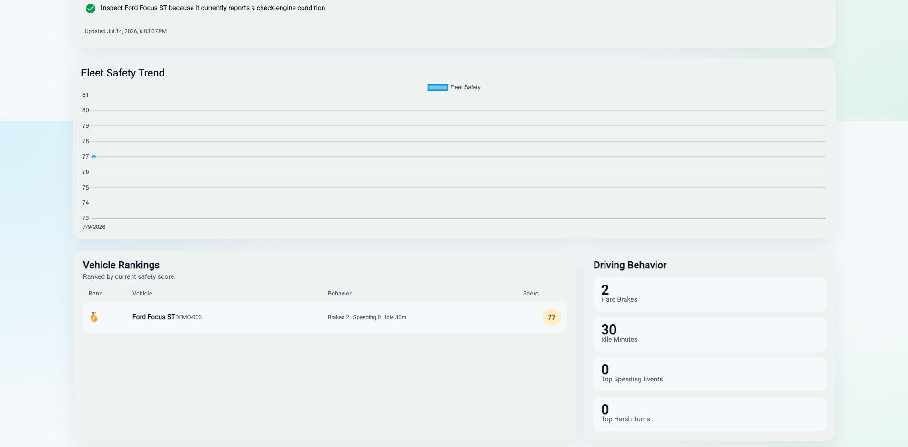
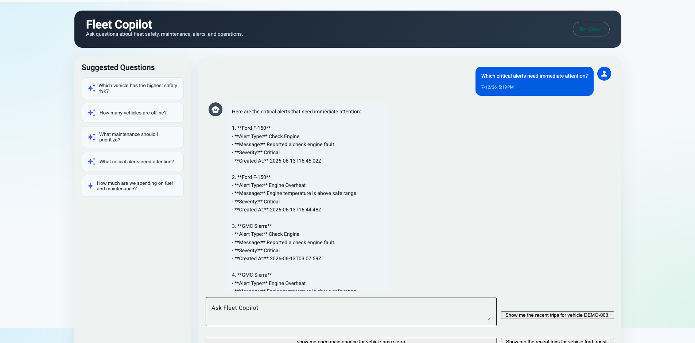
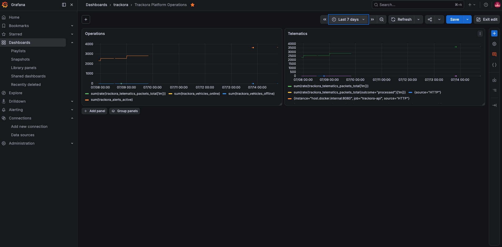
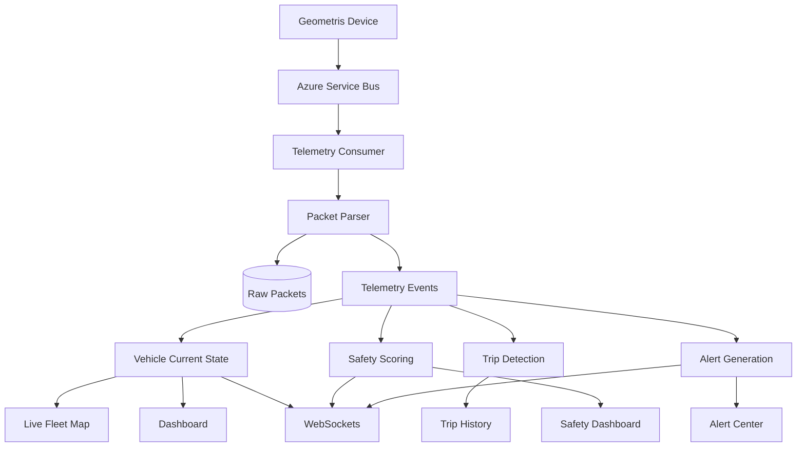
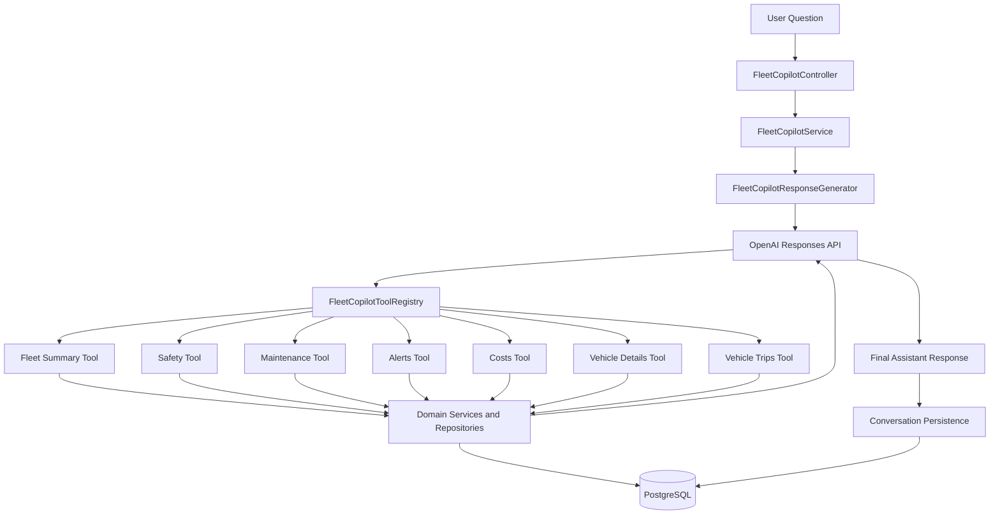

# 🚛 Trackora

A modern fleet management platform built with Spring Boot, Angular, Azure messaging, real-time telemetry, and AI-powered fleet operations.


## Overview

Trackora is a production-style fleet management platform designed to demonstrate modern backend architecture, event-driven systems, real-time telemetry processing, observability, and AI integration.

The platform allows fleet managers to:

- Manage fleets and vehicles
- Track GPS telemetry in real time
- Detect trips automatically
- Monitor driver safety
- Receive maintenance and alert recommendations
- View live dashboards through WebSockets
- Interact with an AI Fleet Copilot capable of answering operational questions using live fleet data

## Why Trackora?

Trackora was built to explore the architecture behind modern fleet management platforms such as Samsara, Geotab, Verizon Connect, and Motive.

The goal was to build a production-style application that demonstrates:

- Event-driven architecture
- Real-time telemetry processing
- AI-assisted fleet operations
- Cloud messaging
- Observability
- Multi-tenant security
- Modern Angular UI

## Project Highlights

- Modular backend architecture
- Extensive REST API coverage
- Broad unit and integration test suite

| Layer            | Technology                      |
|------------------|---------------------------------|
| Backend          | Java 21                         |
| Framework        | Spring Boot 3                   |
| Frontend         | Angular 20                      |
| Security         | Spring Security + JWT           |
| Database         | PostgreSQL                      |
| ORM              | Spring Data JPA                 |
| Messaging        | Azure Service Bus               |
| AI               | OpenAI Responses API            |
| Observability    | Micrometer, Prometheus, Grafana |
| Build            | Gradle                          |
| Testing          | JUnit 5, Mockito, RestAssured   |
| Containerization | Docker                          |


| Capability           | Status |
|----------------------|--------|
| Fleet Management     | ✅      |
| GPS Telematics       | ✅      |
| Trip Detection       | ✅      |
| Driver Safety        | ✅      |
| Live Dashboard       | ✅      |
| AI Copilot           | ✅      |
| Tool Calling         | ✅      |
| Conversation History | ✅      |
| Azure Service Bus    | ✅      |
| WebSockets           | ✅      |
| Observability        | ✅      |

---

## Dashboard




---

## Driver Safety




---

## Fleet Copilot



---

## Grafana



---

## Features

### Fleet Management

- Fleet administration
- Vehicle management
- Maintenance scheduling
- Fuel tracking
- Alerts

### Telematics

- GPS telemetry ingestion
- Automatic trip detection
- Live vehicle status
- Driver safety scoring
- Historical trip replay

### Real-Time

- STOMP WebSockets
- Live dashboard updates
- Live alert updates
- Live safety metrics

### AI Fleet Copilot

- OpenAI Responses API
- Tool calling
- Conversation history
- Fleet context awareness
- Deterministic fallback responses
- Multi-tool orchestration

## Architecture



## Deployment

Current deployment options:

- Local Docker Compose
- Local Gradle execution
- GitHub Actions

Future deployment targets:

- Kubernetes
- Azure Container Apps
- AWS ECS

### Backend Modules

```text
src/main/java/com/fleetwise/api
    ├── auth
    ├── fleet
    ├── vehicle
    ├── maintenance
    ├── fuel
    ├── alerts
    ├── dashboard
    ├── telematics
    ├── trip
    ├── safety
    ├── copilot
    ├── observability
    ├── security
    └── config
```

### AI Architecture



## Testing

The project contains:

- Unit tests
- Integration tests
- API tests
- AI tool tests
- Conversation tests
- Multi-tenant security tests

---

## Document Management

Supports:
- Vehicle documents
- Maintenance invoices
- Image uploads
- Secure downloads
- File validation
- Tenant isolation

Documents are stored on AWS S3 bucket.

## Document storage

See [S3 bucket](docs/operations/document-storage.md).

## Local setup and Docker

See [Local setup](docs/operations/local-development.md).

## AI Configuration

OpenAI integration is disabled by default. Trackora provides deterministic fallback responses when AI is unavailable.

See [OpenAI Configuration](docs/operations/openai-configuration.md).

### API Documentation

See [Swagger info](docs/api/openapi.md).

## Authentication Flow

See [Register/Authentication details](docs/api/authentication.md).

## Running Tests

See [Test execution](docs/development/testing.md).

## Observability details

See [actuator/grafana](docs/operations/observability.md).

## Future Enhancements

- AI streaming responses
- Predictive maintenance
- Mobile application
- Public REST API
- Fleet reporting
- Driver coaching recommendations